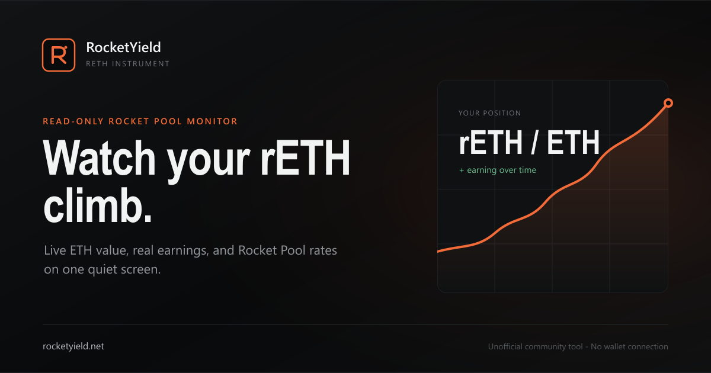

<div align="center">



# RocketYield

**Watch your rETH climb.**

A read-only dashboard for Rocket Pool stakers. Paste an Ethereum address or ENS name and see what your rETH is worth in ETH, what it has really earned, and how fast it is growing.

[**rocketyield.net**](https://rocketyield.net) · [Methodology](https://rocketyield.net/methodology) · [Report a bug](https://github.com/novaheic/RocketYield/issues)

[](https://github.com/novaheic/RocketYield/actions/workflows/deploy-pages.yml)
[](LICENSE)

</div>

---

## Why

rETH doesn't rebase: your token balance stays fixed while each token becomes worth more ETH. That makes the question stakers actually care about — *how much ETH is my rETH worth, and how much has it earned?* — surprisingly hard to answer. Portfolio trackers show rETH as one line in a long list, and the Rocket Pool site leaves the math to you.

RocketYield answers that question on one calm screen, designed to stay open on a second monitor.

## Features

- **Live position in ETH.** The current ETH value of your rETH, ticking up between oracle updates, with fiat value alongside.
- **Real earnings.** Today, 7d, 30d, 90d, and lifetime, calculated from your actual balance history. Buying more rETH doesn't inflate past earnings, and selling doesn't erase them.
- **Yield.** Trailing 7d and 30d APR / APY.
- **Projections.** Expected earnings per day, month, and year at the current 7-day rate, compared with your realized 30-day pace.
- **Charts and history.** rETH/ETH rate over time, daily earnings, and a daily earnings table with CSV and JSON export.
- **Market vs. redemption rate.** Live DEX premium or discount from the Curve rETH/WETH pool.
- **Milestones.** "0.01 ETH earned in about 3 days."
- **Eight fiat currencies.** USD, EUR, GBP, AUD, CAD, CNY, JPY, KRW.
- **Shareable.** The address lives in the URL (`?address=vitalik.eth`), so any view can be bookmarked or shared.

### Privacy by design

- **No wallet connection, no signatures.** RocketYield only reads public chain data.
- **No accounts, no cookies.** Settings like the fiat currency are kept in your browser's `localStorage`; chain data is cached in IndexedDB.
- **Cookieless, first-party visitor counts.** No third-party analytics. Each page load pings `/api/visitors`, which counts one visitor per browser per day using a salted hash that is deleted daily; only daily totals are stored (Cloudflare D1). Wallet addresses, ENS names, balances, and earnings are never recorded. The totals are public at [`/stats`](https://rocketyield.net/stats).

## How it works

Earnings come from the change in the rETH/ETH exchange rate, weighted by how much rETH the address held at each point in time:

```
earnings = Σ (rETH balance held during period × rate change during that period)
```

Any window (7d, 30d, lifetime) is a slice of that timeline. The full write-up, including contracts, sampling, and limitations, is on the [methodology page](https://rocketyield.net/methodology) (English and German).

| Data | Source |
|---|---|
| Current balance and redemption rate | `balanceOf` and `getExchangeRate` on the mainnet rETH contract |
| Balance history | `alchemy_getAssetTransfers` on Alchemy; filtered rETH `Transfer` logs on other providers |
| Rate history | Shared timeline from `GET /api/rates` (Cloudflare KV), with historical `getExchangeRate` calls at the wallet's transfer blocks. Falls back to sampling entirely in the browser if the API is unavailable. |
| ETH fiat prices | Coinbase (live); `/api/historical-prices` → DefiLlama (daily history for the earnings table) |
| Market rate | GeckoTerminal (Curve rETH/WETH) |

Price providers are optional: if they fail, the on-chain ETH figures still load.

> **The ticking balance is an estimate.** Rocket Pool's rate changes in discrete oracle updates, roughly every 24 hours. RocketYield smooths the recent realized rate between updates and snaps to the real on-chain value at each update.

## Tech stack

[React 19](https://react.dev) + [TypeScript](https://www.typescriptlang.org) + [Vite](https://vite.dev) · [viem](https://viem.sh) for chain reads · [Lightweight Charts](https://tradingview.github.io/lightweight-charts/) · [Cloudflare Pages](https://pages.cloudflare.com) + Pages Functions + KV · [Vitest](https://vitest.dev) and [Playwright](https://playwright.dev) for tests.

## Getting started

### Prerequisites

- Node.js **20.19+** or **22.12+**
- An Ethereum mainnet RPC endpoint with **archive reads** and broad `eth_getLogs` support. A free [Alchemy](https://www.alchemy.com) or [Infura](https://www.infura.io) key works. Generic free public endpoints usually reject the log ranges this app needs.

### Run the frontend

```bash
git clone https://github.com/novaheic/RocketYield.git
cd RocketYield
npm install
cp .env.example .env.local   # Windows: copy .env.example .env.local
```

Set `VITE_ETHEREUM_RPC_URL` in `.env.local`, then:

```bash
npm run dev
```

This runs the full dashboard. Without Cloudflare Functions, `/api/rates` is absent and the browser samples rate history itself (slower on first load), and `/stats` has no data.

> **Note:** `VITE_` variables are bundled into the client and visible to anyone. Treat the browser RPC URL as public and use your provider's domain/origin restrictions.

### Run with Cloudflare Pages Functions

To test the shared rate cache (`/api/rates`) and the stats endpoint locally:

```bash
cp .dev.vars.example .dev.vars   # then fill in ETHEREUM_RPC_URL
npm run cf:dev
```

Open <http://localhost:8788>. This needs a configured `wrangler.jsonc` — see [Deploy your own](#deploy-your-own).

### Configuration

| Variable | Where | Purpose |
|---|---|---|
| `VITE_ETHEREUM_RPC_URL` | `.env.local` / build env | Archive RPC used by the browser. Public. |
| `ETHEREUM_RPC_URL` | `.dev.vars` / Pages secret | Server-only archive RPC used to refresh the shared rate cache. |
| `RATE_HISTORY` | `wrangler.jsonc` (KV binding) | KV namespace for the shared rate timeline. |
| `STATS_DB` | `wrangler.jsonc` (D1 binding) | D1 database for daily visitor counts. Tables are created on first use. |

### Scripts

| Command | Description |
|---|---|
| `npm run dev` | Start the Vite dev server |
| `npm run build` | Type-check and build to `dist/` |
| `npm run preview` | Preview the production build |
| `npm run cf:dev` | Build and run with Cloudflare Pages Functions locally |
| `npm run lint` | Run ESLint |
| `npm test` | Run unit tests (Vitest) |
| `npm run test:e2e` | Run responsive end-to-end tests (Playwright) |
| `npm run typecheck:functions` | Type-check the Pages Functions |

## Deploy your own

**Any static host:** run `npm run build` with `VITE_ETHEREUM_RPC_URL` set and publish `dist/`. Everything except the shared rate cache and `/stats` works this way.

**Cloudflare Pages (full setup, free tier):** the repo ships a GitHub Actions workflow ([`deploy-pages.yml`](.github/workflows/deploy-pages.yml)) that builds and deploys on every push to `main`. Use it instead of Cloudflare's "Connect to Git" builds.

1. **Create the Pages project** (without connecting Git):

   ```bash
   npx wrangler login
   npx wrangler pages project create rocketyield
   ```

2. **Create the KV namespace** for rate history and the D1 database for visitor counts:

   ```bash
   npx wrangler kv namespace create RATE_HISTORY
   npx wrangler kv namespace create RATE_HISTORY --preview
   npx wrangler d1 create rocketyield-stats
   ```

3. **Edit `wrangler.jsonc`.** It contains the IDs for the official rocketyield.net deployment. Replace the KV `id` / `preview_id` and the D1 `database_id` with yours.

4. **Add GitHub Actions secrets** under *Settings → Secrets and variables → Actions*:

   | Secret | Value |
   |---|---|
   | `CLOUDFLARE_API_TOKEN` | API token with **Account → Cloudflare Pages → Edit** |
   | `CLOUDFLARE_ACCOUNT_ID` | Your Cloudflare account ID |
   | `VITE_ETHEREUM_RPC_URL` | Archive RPC URL baked into the browser build |

5. **Add the Function secret:**

   ```bash
   npx wrangler pages secret put ETHEREUM_RPC_URL --project-name rocketyield
   ```

6. **Push to `main`** (or run the *Deploy Cloudflare Pages* workflow manually). The deploy URL appears in the Actions log.

The shared rate cache refreshes lazily: when it's empty or older than about six hours, the next `/api/rates` request rebuilds it from the archive RPC. The first cold request after deploy can take a moment.

## Project structure

```
functions/            Cloudflare Pages Functions
  api/rates.ts          Shared rETH/ETH rate timeline (KV-backed)
  api/visitors.ts       Cookieless visitor counter and /stats data (D1-backed)
src/
  components/           Dashboard UI (balance hero, metrics, charts, tables)
  hooks/                useRocketYield: data loading and live ticking
  lib/chain/            viem client, contracts, transfer history, IndexedDB cache
  lib/analytics/        Earnings timeline, daily earnings, units
  lib/                  Formatting, fiat prices, market rate, CSV export
  pages/                Methodology, stats, privacy, and legal pages
tests/                Playwright end-to-end tests
```

## Limitations

- The first load for an old, active wallet must fetch that address's full transfer history, which can take a while. Later visits only request newer blocks.
- RPC providers may rate-limit or reject archive requests. The UI reports these failures instead of substituting sample values.
- Fiat values and the market rate depend on third-party APIs and may be briefly unavailable.

## Contributing

Issues and pull requests are welcome. For larger changes, please open an issue first to discuss the idea.

Before submitting a PR, make sure these pass:

```bash
npm run lint
npm test
npm run build
```

## License

[MIT](LICENSE)

## Disclaimer

RocketYield is an unofficial community tool and is not affiliated with Rocket Pool. Figures are informational estimates, not financial advice — verify anything important on-chain.
